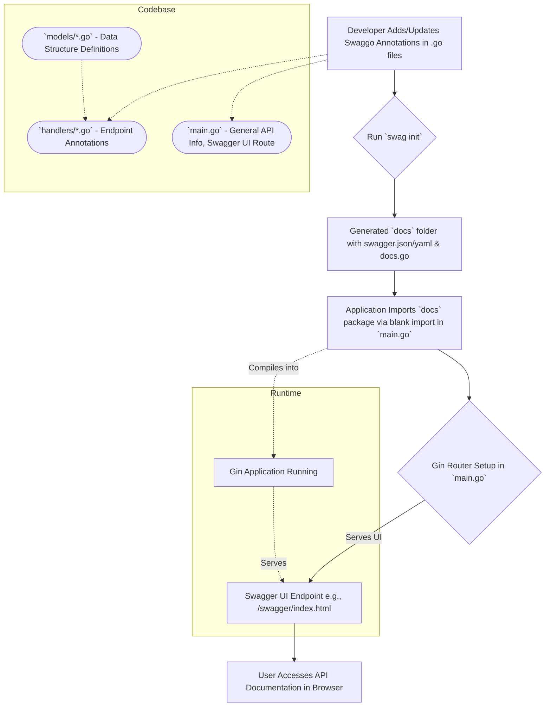

# Plan to Generate Swagger Documentation for GoRecipes API

This document outlines the steps to generate Swagger (OpenAPI) documentation for the GoRecipes Gin-based backend using the `swaggo` toolset.

## 1. Add Dependencies

The following `swaggo` packages need to be added to your `go.mod` file. This can be done by running `go get` for each:

*   `github.com/swaggo/swag/cmd/swag` (Provides the `swag` CLI tool for code generation)
*   `github.com/swaggo/gin-swagger` (Gin middleware to serve Swagger UI)
*   `github.com/swaggo/files` (Contains the static files for Swagger UI)

The `swag init` command (see step 4) will also implicitly add `github.com/swaggo/swag` as a dependency to the generated `docs` package.

## 2. Annotate `main.go` for General API Information

Top-level `swaggo` annotations will be added to `main.go` to define general API information. These comments should be placed right before the `main()` function.

**Example:**
```go
package main

import (
	// ... other imports
	_ "github.com/gaanon/gorecipes_v2/docs" // Adjust if your docs path is different
	swaggerFiles "github.com/swaggo/files"
	ginSwagger "github.com/swaggo/gin-swagger"
)

// @title GoRecipes API
// @version v1
// @description This is the API for the GoRecipes application, allowing users to manage and discover cooking recipes.
// @termsOfService http://example.com/terms/
// @contact.name API Support Team
// @contact.url http://www.example.com/support
// @contact.email support@example.com
// @license.name Apache 2.0
// @license.url http://www.apache.org/licenses/LICENSE-2.0.html
// @host localhost:8080
// @BasePath /api/v1
// @schemes http https
// @securityDefinitions.apikey ApiKeyAuth
// @in header
// @name Authorization
func main() {
    // ... existing main function code ...

    // Swagger endpoint
    // URL: http://localhost:8080/swagger/index.html (or your custom path if configured)
    router.GET("/swagger/*any", ginSwagger.WrapHandler(swaggerFiles.Handler))

    // ... router.Run() ...
}
```
*Note: The `@securityDefinitions` annotation is an example if you plan to add API key authentication. Adjust as needed.*

## 3. Verify Handler and Model Annotations

Ensure all public API handlers in `handlers/recipe_handler.go` (and any other handler files) have comprehensive `swaggo` annotations. These include:

*   `@Summary`: A short summary of what the endpoint does.
*   `@Description`: A more detailed description.
*   `@Tags`: Group related endpoints (e.g., "recipes").
*   `@Accept`: Request content type (e.g., `json`).
*   `@Produce`: Response content type (e.g., `json`).
*   `@Param`: Defines request parameters (path, query, body, header, form).
    *   For body parameters, specify the Go type (e.g., `body models.RecipeRequest true "Recipe to create"`).
*   `@Success`: Defines successful responses (HTTP status code, response type).
    *   Example: `200 {object} models.Recipe` or `200 {array} models.Recipe`.
*   `@Failure`: Defines error responses (HTTP status code, error type).
    *   Example: `400 {object} handlers.APIError "Invalid input"`.
*   `@Router`: Defines the route path and HTTP method (e.g., `/recipes [post]`).

`swaggo` will automatically parse the referenced model structs (e.g., `models.Recipe`, `models.RecipeRequest`, `handlers.APIError`, and their nested types) to generate schema definitions. Ensure all fields in these structs that are part of the API contract are correctly tagged for JSON marshalling (e.g., ``json:"fieldName"``).

## 4. Generate Swagger Files

Use the `swag` CLI tool to parse annotations and generate the Swagger/OpenAPI specification files. These files are typically placed in a `docs` directory within your project.

**Command:**
```bash
swag init -g main.go --output ./docs
```
*   `-g main.go`: Specifies the entry point for `swag` to start parsing (usually `main.go`).
*   `--output ./docs`: Specifies the directory where the generated `docs` package (containing `swagger.json`, `swagger.yaml`, and `docs.go`) will be created.

This command should be run whenever API annotations or relevant model structures are changed.

## 5. Serve Swagger UI

Integrate `gin-swagger` into `main.go` to serve the Swagger UI. This involves:

*   Importing the necessary packages:
    ```go
    import (
        // ... other imports
        _ "github.com/gaanon/gorecipes_v2/docs" // IMPORTANT: Blank import for the generated docs
        swaggerFiles "github.com/swaggo/files"
        ginSwagger "github.com/swaggo/gin-swagger"
    )
    ```
    The blank import `_ "github.com/gaanon/gorecipes_v2/docs"` (adjust the path if your module path or docs directory is different) is crucial. It ensures that the `init()` function in the generated `docs/docs.go` file (which registers the Swagger spec) is executed.

*   Adding a route to the Gin router to serve the Swagger UI:
    ```go
    // Inside main() function, after router initialization
    router.GET("/swagger/*any", ginSwagger.WrapHandler(swaggerFiles.Handler))
    ```
    This will make the Swagger UI accessible, typically at `http://localhost:8080/swagger/index.html`.

## Visual Overview



By following these steps, you will have a self-documenting API with an interactive UI for exploration and testing.